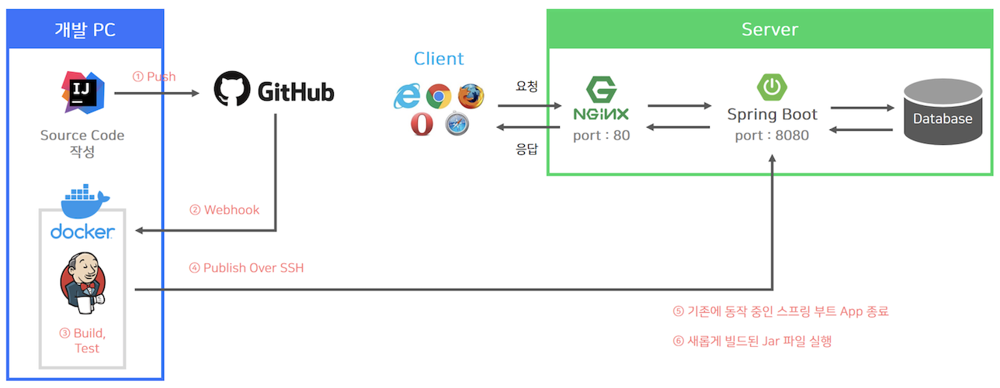
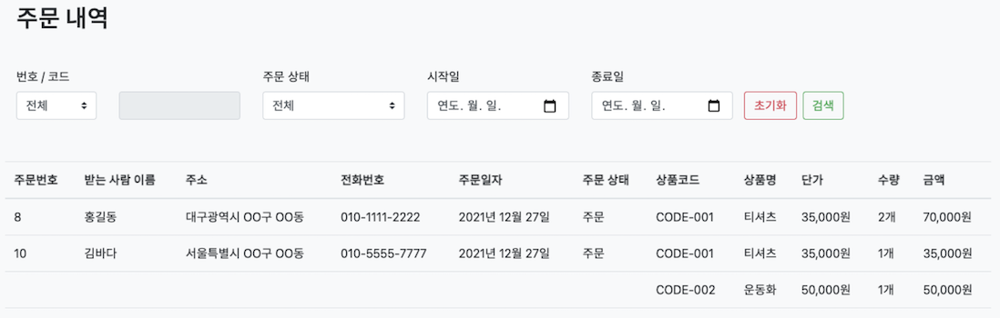

# Online Shop

### 1) 프로젝트 소개

* 스프링 부트와 JPA를 이용하여 온라인 쇼핑몰의 기본 기능을 구현한 프로젝트입니다.

  
  
* 구현 기능은 다음과 같습니다.

  * 회원가입, 로그인, 로그아웃
    
  * 상품 등록 및 관리
    
  * 상품 입고 및 주문
  
  * 재고 관리
    
  * 장바구니 담기 기능
    
  * 등록, 수정, 삭제를 위한 HTTP API 제공
  
### 2) 사용 기술

* **[Back-end]**

    * `Java 11`

    * `Gradle`

    * `Spring Boot 2.3.10`

    * `Spring Web`

    * `Spring Data JPA`
  
    * `Querydsl`

    * `Spring Security`

    * `H2 1.4.200`

    * `PostgreSQL`

    * `Thymeleaf`
  
* **[Front-end]**

    * `Bootstrap 4`

    * `JQuery`
  
### 3) 실행 방법

* ① Repository를 git clone을 해서 로컬 환경에 다운로드 받습니다.

  * `git clone https://github.com/kevinntech/online-shop.git`

* ② 아래 디렉토리로 이동합니다.

  * `cd online-shop`

* ③ 프로젝트를 빌드합니다.

  * `./gradlew clean build`

* ④ 아래 디렉토리로 이동합니다.

  * `cd build/libs` 

* ⑤ Jar 파일을 실행합니다.

  * `java -jar online-shop-0.0.1-SNAPSHOT.jar` 

* ⑥ 웹 브라우저의 주소창에 아래 내용을 입력합니다.

  * `http://localhost:8080/`

* **[참고]** 
  
  * 현재 프로젝트는 인메모리 데이터베이스로 동작합니다.

  * 추가적인 데이터베이스 설정이 필요 할 수도 있습니다.

### 4) 프로젝트 동작 과정


* ① 클라이언트가 회원가입 및 로그인을 합니다.

* ② (관리자인 경우) 상품을 등록한 다음, 상품에 대한 공급을 하면 재고는 증가합니다. 

* ③ 상품 주문은 재고가 존재하는 경우에만 가능합니다.

  * 상품 주문을 완료하면 재고는 감소합니다.
  
### 5) 도메인 모델


  * `User` : 회원

  * `Order` : 주문

  * `OrderProduct` : 주문 상품
  
  * `Product` : 상품

  * `Stock` : 재고

  * `Warehousing` : 상품 공급(입고)

### 6) 프로젝트 전체 구조


* ① 클라이언트가 서버에 요청을 한다.

* ② NGINX(80 port)는 클라이언트의 요청을 받아서 스프링 부트(8080 port)로 요청을 전달한다.

  * 그러면 Controller는 클라이언트의 요청에 해당하는 비즈니스 로직 처리를 Service에게 요청한다.

* ③ Service는 Controller가 전달한 요청을 처리하기 위해서 DB 조회를 Repository에게 요청한다.

* ④ Repository는 Service가 전달한 요청을 처리하기 위해서 실제 쿼리를 만든 다음 DB에 전달한다.    

  * 데이터베이스는 Repository에서 전달한 쿼리를 실행하게 되며 실행 결과를 다시 Repository에 전달하게 된다.

  * 이어서 Repository -> Service -> Controller 순서로 결과를 전달하게 된다.

* ⑤ Controller는 템플릿 엔진에게 Model 정보를 함께 전달하며 뷰 렌더링을 요청하게 된다.

* ⑥ 템플릿 엔진은 전달받은 Model 정보를 참조해서 웹 브라우저가 출력할 결과 화면을 만들게 된다.

* ⑦ 웹 브라우저는 서버로 부터 전달받은 응답 내용을 화면에 출력하게 된다.

### 7) 트러블 슈팅 (Trouble Shooting)

#### (1) URI 설계

* 문제 상황
  
  * URI를 어떠한 방식으로 설계하는 것이 올바른 것인지 판단하기가 어려웠습니다.

* 해결책 
  
  * 해당 문제를 해결하려면 HTTP와 REST에 대해서 먼저 이해할 필요가 있다고 생각해서 학습을 진행하였습니다. 
  
  * 이후 구글링을 통해 `REST API 디자인 가이드`라는 문서를 찾았으며 해당 문서에서 제시하는 기본적인 방향은 **URI로 리소스를 식별하고 리소스에 대한 행위는 HTTP 메소드로 표현**하라는 것이었습니다.  
  
  * 예를 들어, 상품을 제거하는 API의 URI는 아래의 `올바른 URI 설계`와 같은 기준으로 작성하였습니다.
  
    * 잘못된 URI 설계
    
      ```
      POST  /products/delete/{productId}
      ```
    
    * 올바른 URI 설계
    
      ```
      DELETE  /products/{productId}
      ```

#### (2) HTTP API에서 에러가 발생할 때 처리하는 방식을 개선하기

* 문제 상황
  
  * 기존에는 에러가 발생하면 각 컨트롤러의 메소드에서 상황에 맞게 바로 응답하도록 작성하였습니다.
  
    ```java
    @RestController
    @RequiredArgsConstructor
    public class OrderApiController {
    
        private final OrderService orderService;
    
        @PostMapping("/api/v1/orders")
        public ResponseEntity save(@CurrentUser User user, @Valid @RequestBody OrderSaveRequestDto requestDto, Errors errors) {
            // 에러 발생 시, 각 상황에 맞게 바로 응답
            if (errors.hasErrors()) {
                return ResponseEntity.badRequest().build();
            }
            
            orderService.saveNewOrder(user, requestDto);
    
            return ResponseEntity.ok().build();
        }
    
    }
    ```
  
  * 하지만 에러 발생할 때, 에러를 처리하는 코드가 여러 컨트롤러에서 중복되기 때문에 변경 사항이 발생하면 여러 곳에서 코드 변경이 필요한 문제점이 있다고 생각합니다. (즉, 중복 코드가 발생하고 있음)
  
  * 따라서 하나의 전역 컨트롤러(`@RestControllerAdvice`)에서 에러를 처리 하도록 개선하였습니다.

* 해결책

  * 해당 문제를 해결하기 위해 구글링으로 `Spring Guide - Exception` 전략이라는 문서를 찾았습니다.

  * 찾은 문서에서 제시한 내용은 @ControllerAdvice를 이용한 전역 컨트롤러를 선언한 다음, 전역 컨트롤러 한 곳에서 모든 예외를 처리하며 클라이언트에서 예외 처리를 항상 동일한 로직으로 처리 할 수 있도록 통일된 ErrorResponse 객체를 사용하라는 것이었습니다.

  * 문서에서 제시한 바를 프로젝트에 적용함으로써 중복 코드를 줄일 수 있었습니다.

* 문제를 개선한 코드
  
  * ① 아래와 같은 컨트롤러에서 바인딩 에러가 발생하거나 각 상황에 맞는 예외가 발생한다고 가정합니다.
  
    ```java
    @RestController
    @RequiredArgsConstructor
    public class OrderApiController {
    
        private final OrderService orderService;
    
        @PostMapping("/api/v1/orders")
        public ResponseEntity save(@CurrentUser User user, @Valid @RequestBody OrderSaveRequestDto requestDto) {
            // 주문 등록 처리
            orderService.saveNewOrder(user, requestDto);
    
            return ResponseEntity.ok().build();
        }
    
    }
    ```

  * ② `ApiExceptionHandler`는 각 컨트롤러에서 발생한 예외를 처리하는 역할을 하는 전역 컨트롤러이며 클라이언트에게 상태 코드와 `ApiErrorResponse`를 JSON 형태로 제공합니다.
    
    ```java
    @RestControllerAdvice
    @Slf4j
    public class ApiExceptionHandler {
    
        @ExceptionHandler(MethodArgumentNotValidException.class)
        public ResponseEntity<ApiErrorResponse> handleMethodArgumentNotValidException(MethodArgumentNotValidException ex) {
            log.error("handleMethodArgumentNotValidException", ex);
            ApiErrorResponse response = ApiErrorResponse.of(ErrorCode.INVALID_INPUT_VALUE, ex.getBindingResult());
    
            return new ResponseEntity<>(response, HttpStatus.valueOf(ErrorCode.INVALID_INPUT_VALUE.getStatus()));
        }
    
        @ExceptionHandler(NotValidArgumentException.class)
        public ResponseEntity<ApiErrorResponse> handleNotValidArgument(NotValidArgumentException ex) {
            log.error("handleNotValidArgument", ex);
            ApiErrorResponse response = ApiErrorResponse.of(ErrorCode.INVALID_INPUT_VALUE);
    
            return new ResponseEntity<>(response, HttpStatus.valueOf(ErrorCode.INVALID_INPUT_VALUE.getStatus()));
        }
    
        @ExceptionHandler(DataNotFoundException.class)
        public ResponseEntity<ApiErrorResponse> handleDataNotFound(DataNotFoundException ex) {
            log.error("DataNotFoundException", ex);
            ApiErrorResponse response = ApiErrorResponse.of(ErrorCode.NOT_FOUND_VALUE);
    
            return new ResponseEntity<>(response, HttpStatus.valueOf(ErrorCode.NOT_FOUND_VALUE.getStatus()));
        }
    
        @ExceptionHandler(DuplicateDataException.class)
        public ResponseEntity<ApiErrorResponse> handleDuplicateData(DuplicateDataException ex) {
            log.error("DuplicateDataException", ex);
            ApiErrorResponse response = ApiErrorResponse.of(ErrorCode.DUPLICATION);
    
            return new ResponseEntity<>(response, HttpStatus.valueOf(ErrorCode.DUPLICATION.getStatus()));
        }
    
    }
    ```

  * ③ `ApiErrorResponse`는 에러 정보를 클라이언트에게 응답하기 위해 작성했습니다.

    ```java
    @Getter
    @NoArgsConstructor(access = AccessLevel.PROTECTED)
    public class ApiErrorResponse {
    
        private int status;
    
        private String code; // 에러에 대한 고유 식별자
    
        private String message; // 에러에 대해 사람이 읽을 수 있는 간단한 메세지
    
        private List<FieldError> errors;
    
        private LocalDateTime timestamp;
    
        private ApiErrorResponse(ErrorCode code) {
            this.status = code.getStatus();
            this.code = code.getCode();
            this.message = code.getMessage();
            this.errors = new ArrayList<>();
            this.code = code.getCode();
            this.timestamp = LocalDateTime.now();
        }
    
        private ApiErrorResponse(ErrorCode code, List<FieldError> errors) {
            this.status = code.getStatus();
            this.code = code.getCode();
            this.message = code.getMessage();
            this.errors = errors;
            this.code = code.getCode();
            this.timestamp = LocalDateTime.now();
        }
    
        public static ApiErrorResponse of(ErrorCode code) {
            return new ApiErrorResponse(code);
        }
    
        public static ApiErrorResponse of(ErrorCode code, BindingResult bindingResult) {
            return new ApiErrorResponse(code, FieldError.of(bindingResult));
        }
    
        @Getter
        @NoArgsConstructor(access = AccessLevel.PROTECTED)
        public static class FieldError {
            private String field;
            private String value;
            private String reason;
    
            private FieldError(String field, String value, String reason) {
                this.field = field;
                this.value = value;
                this.reason = reason;
            }
    
            private static List<FieldError> of(final BindingResult bindingResult) {
                return bindingResult.getFieldErrors()
                        .stream()
                        .map(error -> new FieldError(
                                        error.getField(),
                                        error.getRejectedValue() == null ? "" : error.getRejectedValue().toString(),
                                        error.getDefaultMessage()))
                        .collect(Collectors.toList());
            }
        }
    }
    ```

  * ④ `ErrorCode`는 에러 코드를 한 곳에서 관리하도록 enum 타입으로 선언하였습니다.

    ```java
    @Getter
    @RequiredArgsConstructor
    public enum ErrorCode {
    
        INVALID_INPUT_VALUE(400, "ERROR-001", "Invalid Input Value"),
        NOT_FOUND_VALUE(404, "ERROR-002", "Data Not Found"),
        DUPLICATION(400, "ERROR-003", "Data is Duplication");
    
        private final int status;
        private final String code;
        private final String message;
    
    }
    ```
  
  * 참고 자료
  
    * https://cheese10yun.github.io/spring-guide-exception/

    * https://www.baeldung.com/rest-api-error-handling-best-practices

#### (3) Jenkins를 이용한 CI/CD 환경 구축

* 문제 상황

  * 코드를 변경할 때 마다 변경 사항을 GitHub에 반영하고 직접 원격 서버에 SSH로 접속해서 GitHub으로 부터 코드를 Pull 받은 다음에 빌드를 하고 기존에 구동 중인 스프링 부트 애플리케이션을 종료한 다음, 새롭게 빌드된 애플리케이션을 실행하는 방식이었기 때문에 번거로운 부분이 있었습니다.

* 해결책
  
  * 이러한 번거로움을 해소하기 위해 Jenkins, GitHub WebHook를 이용하여 배포 자동화 환경을 구축하였습니다.
    
  * 이제 개발자가 변경된 소스코드를 GitHub으로 Push를 하면 Webhook를 통해서 Push 이벤트가 발생했다는 것을 개발 PC(로컬 환경)에서 구동 중인 젠킨스에게 알려주고 젠킨스는 Build와 Test를 진행한 다음, 변경된 Jar 파일을 원격 서버에 배포하고 실행합니다.  

* 문제를 개선한 프로젝트 구조

  
  
  * ① GitHub에 소스코드를 Push 한다.
  
  * ② GitHub의 Webhook을 이용해서 Jenkins에게 알린다.
  
  * ③ Jenkins가 GitHub으로 부터 변경된 소스코드를 가져와서 Build와 Test를 한다.
  
  * ④ Jenkins 플러그인(Publish Over SSH)을 이용해서 배포 서버에 Build한 파일을 전송한다. 그리고 실행할 명령도 함께 전송한다.
  
  * ⑤ 기존에 구동 중인 스프링 부트 애플리케이션을 종료한다.
  
  * ⑥ 새롭게 빌드된 Jar 파일을 실행한다.

#### (4) Querydsl 도입

* 문제 상황

  * 기존에는 JPQL를 문자열 연산으로 작성했기 때문에 개발자가 실수할 가능성이 있었습니다.

  * 그리고 동적 쿼리를 작성하는 것이 불편했습니다.

* 해결책 

  * Querydsl를 도입해서 기존에는 문자열 연산으로 작성했던 JPQL를 자바 코드로 작성할 수 있으며 컴파일 시점에 오류를 발견할 수 있도록 개선하였습니다.
  
  * 그리고 아래 그림처럼 검색 조건에 따라 다른 쿼리가 실행 되어야 하는 상황에서 동적 쿼리를 편리하게 작성할 수 있습니다.
  
      

#### (5) 단순 에러에 대한 해결책

* Gradle 빌드 시, LOMBOK 관련 에러 (`variable userService not initialized in the default constructor`)

  * Gradle 5에서는 애노테이션 프로세서를 별도로 나열해야 합니다.

    ```
    dependencies {
        compileOnly 'org.projectlombok:lombok:1.18.20'
        annotationProcessor 'org.projectlombok:lombok:1.18.20'
        
        testCompileOnly 'org.projectlombok:lombok:1.18.20'
        testAnnotationProcessor 'org.projectlombok:lombok:1.18.20'
    }
    ```
  
    * [참고] https://stackoverflow.com/questions/54768504/upgrading-from-java-10-to-java-11-and-gradle-4-10-to-gradle-5-2-variable-not

* `@Valid` 애노테이션이 import 되지 않는 문제

  * 스프링 부트 버전 2.3부터 `starter-web` 의존성에 `spring-boot-starter-validation`가 제외되었으므로 별도로 의존성을 추가해야 합니다.
  
  * `implementation 'org.springframework.boot:spring-boot-starter-validation'`